# Architecture Detail

[← Back to README](../README.md)

## Top-level Flow

```mermaid
flowchart LR
    A[pipeline.py] --> B[CTF-reg/<br/>browser_register.py<br/>Camoufox + Turnstile]
    B --> C[CTF-pay/card.py<br/>Stripe Checkout 重放]
    C --> D[Stripe confirm<br/>+ ChatGPT /approve]
    D --> E[Camoufox PayPal<br/>协议授权]
    E --> F[Stripe poll<br/>state=succeeded]
    F --> G[Camoufox 二次登录<br/>Codex OAuth + PKCE]
    G --> H[refresh_token<br/>output/webui.db &#40;SQLite&#41;]
    H --> I[Optional: Push to gpt-team /<br/>CPA / Other downstream]
```



---

## File Organization

```
Gpt-Agreement-Payment/
├── pipeline.py                     # Orchestrator: Single / Batch / Daemon / Self-dealer
├── CTF-pay/                        # Stripe + PayPal 协议重放
│   ├── card.py                     # Main program, approx 8000 lines
│   ├── hcaptcha_auto_solver.py     # Visual solver (VLM + CLIP + Playwright)
│   ├── hcaptcha_bridge_helper.py   # Interactive debug tool
│   ├── local_mock_gateway.py       # Stripe state machine local mock
│   ├── retry_house_decline.py      # Card decline final state retry wrapper
│   └── config.*.json               # Templates in-repo, runtime config gitignored
├── CTF-reg/                        # ChatGPT Registration Subsystem
│   ├── browser_register.py         # Camoufox true browser registration
│   ├── auth_flow.py                # Pure HTTP registration (Backup)
│   ├── sentinel.py                 # OpenAI Sentinel PoW token
│   ├── mail_provider.py            # Generate catch-all email + delegate cf_kv_otp_provider to get OTP
│   ├── cf_kv_otp_provider.py       # Read OTP from Cloudflare KV (Worker writes)
│   ├── http_client.py              # curl_cffi / requests factory
│   └── config.py                   # dataclass config definition
├── docs/                           # Detailed documentation
└── output/                         # Runtime artifacts（gitignored）
    ├── webui.db                  # SQLite runtime store
    ├── SQLite runtime_meta[daemon_state]
    └── logs/
```

---

## Subsystems

### `CTF-pay/` —— Payment protocol replay main program

#### `card.py`（Approx 8000 lines单文件）

Intentionally made as a single large file, partitioned by function instead of modules. Reasons:

- Protocol link is a single line, splitting modules increases cross-file navigation costs
- Large amount of local states passed between phases, splitting makes parameter lists messy
- Single file is easy for overall reading and positioning

Main Partitions：

| Partition | Approx line numbers | Content |
|---|---|---|
| Config Loading | 200–600 | `load_config()`、JSON validation, CLI parsing |
| HTTP Client | 600–1100 | curl_cffi wrapper, TLS fingerpints, proxy |
| Stripe Protocol | 1100–3000 | init / lookup / confirm / 3DS / poll |
| ChatGPT auth | 3000–4500 | session management, access_token refresh |
| Camoufox | 4500–6000 | PayPal browser flow, second OAuth login |
| Exceptions + Main Entry | 6000–8000 | Exception classification, daemon hooks, command entry |

#### `hcaptcha_auto_solver.py`（Approx 4000 lines standalone file）

**Communicates with `card.py` via subprocess, not import.** 原因是 ML 依赖（torch / CLIP / opencv）装在独立 venv，跟主程序的 venv 隔离。

See details in [`hcaptcha-solver.md`](hcaptcha-solver.md)。

#### 其他

- **`hcaptcha_bridge_helper.py`**：CLI tool, allows manual screenshot / click / submit after connecting to hCaptcha bridge, for debugging
- **`local_mock_gateway.py`**：Local HTTP mock server, simulates Stripe state machine (challenge_pass_then_decline / challenge_failed / no_3ds_card_declined)
- **`retry_house_decline.py`**：Wrapper retrier, targeting "direct final state card decline" instead of "entering challenge"

### `CTF-reg/` —— ChatGPT Registration Subsystem

Launched by `card.py::auto_register`, registers ChatGPT account from scratch and obtains access_token.

| 文件 | Responsibilities |
|---|---|
| `browser_register.py` | Camoufox true browser registration主路径，过 Cloudflare Turnstile |
| `auth_flow.py` | Pure HTTP registration path, backup (incomplete coverage) |
| `sentinel.py` | OpenAI Sentinel PoW token generation (browser fingerprint simulation + SHA-3) |
| `mail_provider.py` | catch-all email generation + delegating KV to get OTP |
| `cf_kv_otp_provider.py` | Reading worker-written OTP from CF KV (replacing IMAP) |
| `http_client.py` | HTTP Client工厂，优先 curl_cffi 做 TLS 指纹 |
| `config.py` | dataclass config definition |

### `pipeline.py` —— 编排器

Chaining `CTF-reg/` and `CTF-pay/` together, exposing four modes:

| Mode | Entry Function |
|---|---|
| Single | `pipeline()` |
| Batch Parallel | `batch()` |
| Self-dealer | `self_dealer()` |
| Daemon | `daemon()` |

See details in [`operating-modes.md`](operating-modes.md)。

---

## Protocol Link Details

### Stripe Checkout Complete Link

```
init
 → elements/sessions
   → consumers/sessions/lookup
     → Address / tax_region update
       → confirm
         (inline_payment_method_data 或 shared_payment_method Mode)
         → 3ds2/authenticate
           → poll
```

Common Pitfalls：

- `setatt_` / `source` Presence of value doesn t mean success, just obtained 3DS authenticate source
- `state = challenge_required` 且 `ares.transStatus = C` means **browser side needs to complete the challenge**，not a dead card
- Only after the browser completes the challenge will the intent / setup_intent state advance

### PayPal billing agreement Complete Link

```
B1: Enter protocol authorization page (Stripe redirect)
 → B-DDC: Device fingerprint collection (includes DataDome slider possibility)
   → B2: Email + password login
     → B3: Protocol authorization agreement
       → B6: hermes path
         → B7: funding selection
           → B8: redirect back to Stripe
```

DataDome 滑块会在 B-DDC 或 B6 出现，daemon Mode有自动拖拽（看 [`daemon-mode.md`](daemon-mode.md)）。

### Codex OAuth + PKCE Second Login

支付成功后启动新 Camoufox 实例，打开 Codex authorize URL：

```
GET https://auth.openai.com/oauth/authorize
  ?client_id=YOUR_OPENAI_CODEX_CLIENT_ID
  &redirect_uri=http://localhost:1455/auth/callback
  &codex_cli_simplified_flow=true
  &code_challenge=<PKCE>
  &state=<random>
```

走流程：

1. 填邮箱 + 密码
2. 可能触发邮箱 OTP（CF Email Worker → KV，毫秒级落库）
3. Codex consent 页点 Continue
4. Playwright route 拦 `localhost:1455` callback，提取 `code`
5. POST `/oauth/token` with `code_verifier` → 拿到 `refresh_token`

---

## 异常分类

```python
# CTF-pay/card.py 里定义的核心异常
CheckoutSessionInactive     # Stripe session 失活
ChallengeReconfirmRequired  # hCaptcha 结果失效
FreshCheckoutAuthError      # ChatGPT 侧凭证 / 账号问题
DatadomeSliderError         # PayPal DataDome 滑块解算失败
WebshareQuotaExhausted      # Webshare 替换代理配额耗尽
```

每种异常的恢复策略看 [`debugging.md`](debugging.md#常见异常)。

---

## 数据流

### `output/webui.db`

运行时账号 / 支付 / OAuth 状态都存放在 SQLite 数据库 `output/webui.db` 中。主要表包括：

- `registered_accounts`：注册成功账号的完整凭证（`password` / `access_token` / `session_token` / `device_id` / cookies 等）
- `pipeline_results`：pipeline Single / 批量 / self-dealer 的结果摘要
- `card_results`：`card.py` 的支付终态和补字段结果
- `oauth_status`：free-only / RT 维护时的 OAuth 状态机

> 这部分是运行时数据，不再使用 JSONL 作为主存储。

### `SQLite runtime_meta[daemon_state]`

State snapshot for daemon mode (used for resuming after restart):

```json
{
  "started_at": "2026-04-27T03:14:22Z",
  "total_attempts": 761,
  "total_succeeded": 472,
  "total_failed": 289,
  "consecutive_failures": 0,
  "ip_no_perm_streak": 0,
  "current_proxy_ip": "198.51.100.X",
  "total_ip_rotations": 16,
  "webshare_rotation_disabled": false,
  "current_zone": "zone-a.example",
  "zone_ip_rotations": 0,
  "last_stats": { "total_active": 44, "usable": 38, "no_invite_permission": 5 }
}
```

---

## Boundaries with External Systems

| System | Role | Required |
|---|---|---|
| **OpenAI** | Register + Login ChatGPT, retrieve OAuth refresh_token | ✅ Required |
| **Stripe** | Checkout session flow | ✅ Required |
| **PayPal** | Payment settlement | ✅ (Unless using pure card payment) |
| **Cloudflare** | Catch-all email subdomain, passing Turnstile during registration | ✅ Required |
| **Captcha Solving Platform** (API compatible) | Passive captcha + fallback | Optional (Browser passive captcha takes priority, platform as fallback) |
| **Webshare** (or self-owned proxy) | Exit IP | ✅ Required |
| **VLM endpoint** | hCaptcha solving | Optional (Residential/fake residential IPs usually don't trigger; falls back to CLIP if VLM is absent) |
| **gpt-team / CPA** | Downstream management system | Optional |

All boundaries are toggleable/replaceable in the config.
